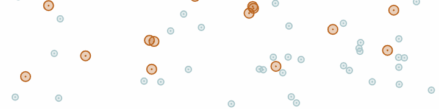

# Pandemic Simulation
Simulation inspired the popular [Why outbreaks like
coronavirus spread exponentially and how to "flatten the curve"](https://www.washingtonpost.com/graphics/2020/world/corona-simulator/)
article by Harry Stevens published in the Washington Post
on March 14, 2020. The visualisation and implementation
was inspired by [Coding Train's Quadtree coding challenge #98](https://thecodingtrain.com/CodingChallenges/098.1-quadtree.html)
where it is featured as a community contribution.

The simulation can be viewed and controlled [here](https://dansarno.github.io/p5-pandemic-simulation/).

  

#### Key Bindings
- `p` = pause/resume simulation
- `r` = restart simulation
- `h` = show/hide quadtree
- `f` = hide/show frames per second

### About
This project is a simple visual representation of a spatial SIR
(susceptible, infectious, recovered) model built with p5.js.

Members of the population are represented as dots bouncing
around on a 2d plane with random speeds and directions.
Each person has a radius within which infection can travel if one
person is susceptible and the other person is infected. A person
remains infected for between 100 and 140 frames after which they
have recovered and can no longer be a vector of infection.

A simulation like this lends itself well to the object-orientated 
programming model, with members of the population, the population
as a whole and the environment having unique attributes
and behaviours. This code base is configurable and expandable,
with additional attributes like...
- a person's age
- a person's individual R number
- an infected person's viral load (based of proximity when infection occurred)

... and behaviours like...
- slowing down of the infected
- lockdown simulation, with most members of the population stopping
- avoidance of the infected by the susceptible

... all being simple to incorporate.

### Behind The Scenes - Quadtree Implementation
The simulation uses a quadtree data structure to hold the location
and information of the members of the population. A quadtree
is a commonly used data structure which is implemented when there
is a need to efficiently detect collisions of many particles on a
2D plane.
